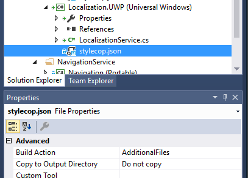
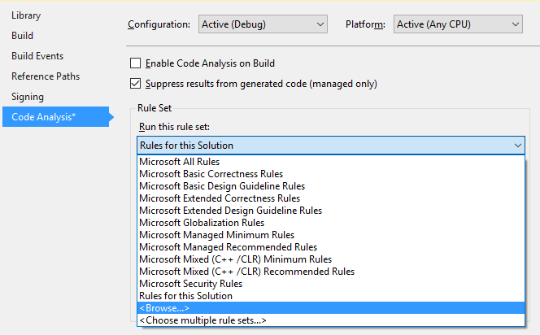

# Code Design Guidelines

This repository includes the **Code Design Guidelines for C#** used by **Windows Platform Team** in **Plain Concepts**.

With this files you could increase your code design guidelines only with a few steps.

## How this works

Based on [**StyleCop Analyzers for the .NET Compiler Platform**](https://github.com/DotNetAnalyzers/StyleCopAnalyzers). This Code Design Guidelines can be modified and improved by using this [**guide**](https://github.com/DotNetAnalyzers/StyleCopAnalyzers/blob/master/documentation/Configuration.md).

We use the both solutions showed at [**configuration**](https://github.com/DotNetAnalyzers/StyleCopAnalyzers/blob/master/documentation/Configuration.md) section of [**StyleCop Analyzers for the .NET Compiler Platform**](https://github.com/DotNetAnalyzers/StyleCopAnalyzers) documentation: [**Code analysis rule set files**(https://docs.microsoft.com/es-es/visualstudio/code-quality/using-rule-sets-to-group-code-analysis-rules) and [**stylecop.json**](https://github.com/DotNetAnalyzers/StyleCopAnalyzers). 

## How to use

1. Move *plainconcepts.ruleset* and *stylecop.json* to your solution root folder. If you want to use this guidelines only in a specific project, move this files to the project root folder.

### Install StyleCop

1. Open your solution. Move *stylecop.json* to your project root like a link file (press *Ctrl* + *Shift* while moving).
1. In properties window, change **BuildAction** property to **AdditionalFiles**.

    

1. Install [**NuGet** package **StyleCop.Analyzers**](https://www.nuget.org/packages/StyleCop.Analyzers) to your project.

### Install Code analysis rule set

1. Open **Properties** of your project and go to the **Code Analysis** section.
1. In the Rule Set part click in the combobox and select **\<Browse\>** option.

    

1. Search for the file **plainconcepts.ruleset** previously moved to your physical folder root.

### Analyze

You only need to **recompile** your project after installation. In *output* window you will see all the **errors** and **warnings** about code design guidelines.
